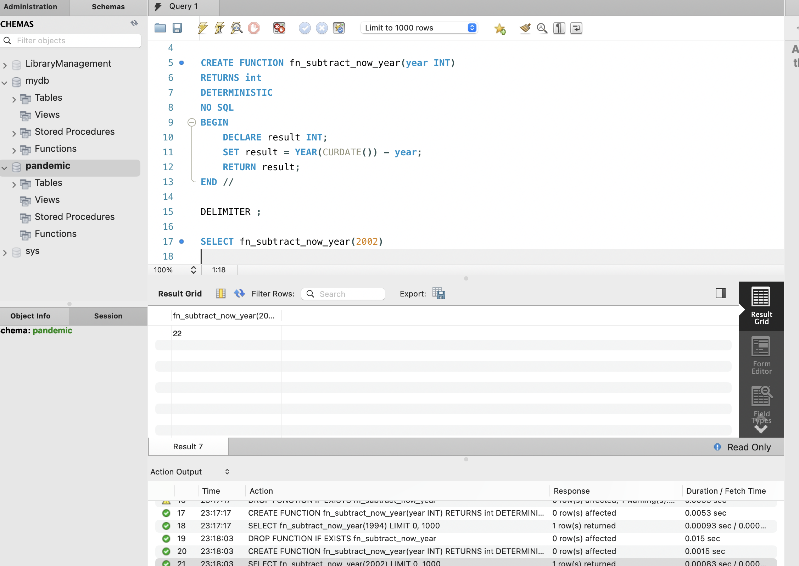

# Покрокова інструкція виконання фінального проєкту

## Результат виконаного ДЗ

1. Завантажте дані:

- Створіть схему pandemic у базі даних за допомогою SQL-команди.
- Оберіть її як схему за замовчуванням за допомогою SQL-команди.
- Імпортуйте [**дані**](https://drive.google.com/file/d/1lHEXJvu2omYRgvSek6mHq-iQ3RmGAQ7e/view) за допомогою Import wizard так, як ви вже робили це у темі 3.
  [**infectious_cases.csv**](https://prod-files-secure.s3.us-west-2.amazonaws.com/89fec302-e51c-45d8-a968-db8bdab456d2/74d1694c-7c06-403a-b8fa-301608033701/infectious_cases.csv)
- Продивіться дані, щоб бути у контексті.

2. Нормалізуйте таблицю infectious_cases. Збережіть у цій же схемі дві таблиці з нормалізованими даними.
```js
CREATE SCHEMA IF NOT EXISTS pandemic;

USE pandemic;
```


3. Проаналізуйте дані:

- Для кожної унікальної комбінації Entity та Code або їх id порахуйте середнє, мінімальне, максимальне значення та суму для атрибута Number_rabies. Результат відсортуйте за порахованим середнім значенням у порядку спадання.
```js
USE pandemic;

CREATE TABLE countries(
id INT PRIMARY KEY AUTO_INCREMENT,
code VARCHAR(8) UNIQUE,
country VARCHAR(32) NOT NULL UNIQUE
);

INSERT INTO countries (code, country)
SELECT DISTINCT code, entity FROM infectious_cases;

CREATE TABLE cases_normalized
AS SELECT * FROM infectious_cases;

ALTER TABLE cases_normalized
ADD id INT PRIMARY KEY AUTO_INCREMENT FIRST,
ADD country_id INT AFTER id,
ADD CONSTRAINT fk_country_id FOREIGN KEY (country_id) REFERENCES countries(id);

UPDATE cases_normalized i
JOIN countries c ON i.code = c.code
SET i.country_id = c.id
WHERE i.id > 0;

ALTER TABLE cases_normalized
DROP COLUMN entity,
DROP COLUMN code;

SELECT * FROM cases_normalized;
```


- Оберіть тільки 10 рядків для виведення на екран.
```js
USE pandemic;

SELECT id, MAX(number_rabies) AS max_value, 
MIN(number_rabies) AS min_value,
AVG(number_rabies) AS average_value
FROM cases_normalized
WHERE number_rabies IS NOT NULL AND number_rabies <> ''
GROUP BY id
ORDER BY average_value DESC
LIMIT 10;
```


4. Побудуйте колонку різниці в роках.

Для оригінальної або нормованої таблиці для колонки Year побудуйте з використанням вбудованих SQL-функцій:

- атрибут, що створює дату першого січня відповідного року,
```js
SELECT Entity, Code, Year, 
CONCAT(Year, "-01-01") AS year_start_date
FROM infectious_cases;
```


- атрибут, що дорівнює поточній даті,
```js
SELECT Entity, Code, Year, 
CURDATE() AS year_current_date
FROM infectious_cases;
```


- атрибут, що дорівнює різниці в роках двох вищезгаданих колонок.
```js
SELECT Entity, Code, Year,
TIMESTAMPDIFF(YEAR, CONCAT(Year, '-01-01'), CURDATE()) AS difference_year
FROM infectious_cases;
```


5. Побудуйте власну функцію.

- Створіть і використайте функцію, що будує такий же атрибут, як і в попередньому завданні: функція має приймати на вхід значення року, а повертати різницю в роках між поточною датою та датою, створеною з атрибута року (1996 рік → ‘1996-01-01’).
```js
DROP FUNCTION IF EXISTS fn_subtract_now_year;

DELIMITER //

CREATE FUNCTION fn_subtract_now_year(year INT)
RETURNS int
DETERMINISTIC
NO SQL
BEGIN
	DECLARE result INT;
    SET result = YEAR(CURDATE()) - year;
    RETURN result;
END //

DELIMITER ;

SELECT fn_subtract_now_year(2002)    
    
```



